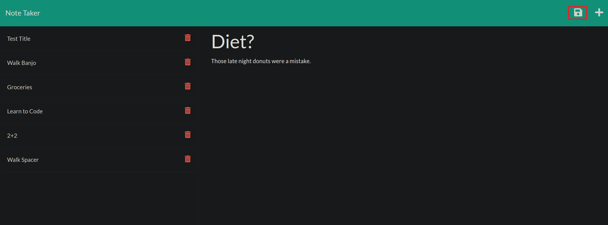

# Note-Taker

This is an application for taking notes and viewing previously saved notes. Once on the landing page, click on the Get Started Button to create a new note and view previously saved notes.

Here's a link to the deployed site: https://mchambersiv.github.io/portfolio-v4-react/

## ScreenShots
This is the page on load.

This is the notes page.

This is one of the previously saved notes.

This is the creation of a new note. Notice the floppy at the upper right hand of the image, that is the button that allows the saving of a new note.

This all the notes again after a page reload with the newly created note at the bottom of the list.

